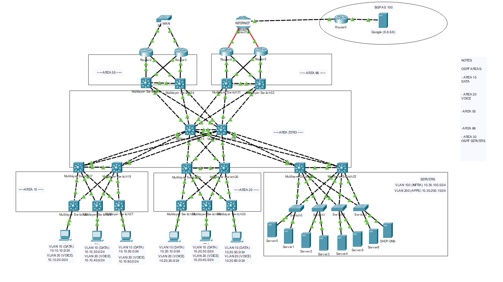

# Routed Access-Layer Enterprise Network

Designed and implemented a routed access-layer enterprise network using Cisco Layer 3 switching and OSPF, demonstrating simplified convergence, improved fault isolation, and scalable routing within a campus topology. Based on the [Cisco Routed Access Design Guide](https://www.cisco.com/c/en/us/td/docs/solutions/Enterprise/Campus/routed-ex.html).

## Topology

## Technologies and Protocols

| Category | Technologies |
|----------|-------------|
| **Routing** | OSPF (multi-area with stub areas), Route Summarization, Loopback Interfaces |
| **Switching** | VLANs, SVIs (access-layer only), Rapid PVST+ |
| **Redundancy** | HSRP (server VLANs only) |
| **Services** | DHCP Relay (`ip helper-address`) |
| **Design** | Routed Access Model, L3 inter-switch links (no trunking) |

## Key Skills Demonstrated

- Routed access-layer design eliminating spanning tree between switches
- Multi-area OSPF with stub/totally stubby area configuration
- Route summarization to reduce LSDB entries and SPF calculations
- Layer-3 inter-switch links replacing traditional trunk-based designs
- HSRP limited to server VLANs only (no gateway redundancy needed at access)
- Fault isolation — failures localised without broadcast storm propagation
- Full bandwidth utilisation with all uplinks actively forwarding

---

## Background

Traditional campus designs rely on Layer 2 switching between the access and distribution tiers, which introduces challenges such as spanning tree complexity, blocked links, and extended recovery times.

The routed access model removes Layer 2 dependencies by enabling Layer 3 routing on access switches. Each access layer VLAN resides in a unique subnet, limiting the scope of broadcast domains, and OSPF is used for internal routing.

---

## Advantages

- Eliminates spanning tree between switches (only used for host connectivity).
- No need for HSRP or VRRP between switches except at the server network.
- Simplified multicast operation and no trunking between access and distribution.
- No management VLAN required, reducing administrative overhead.
- Improved load balancing with all uplinks forwarding packets.
- Faster failure detection and convergence due to local routing.
- Reduced OSPF SPF calculations thanks to route summarization toward the core.
- Fault containment — failures are localised, preventing broadcast storms.

---

## Disadvantages

- More complex to design and initially implement.
- Layer 3 switches cost more than Layer 2 switches.
- Applications requiring Layer 2 adjacency cannot operate across routed segments.

---

## Network Design Summary

- **VLANs/Subnets:** Each VLAN assigns a unique /24 subnet (e.g., VLAN 10: 10.10.10.0/24, VLAN 20: 10.10.20.0/24).
- **SVIs:** Configured only on access switches to enable local routing and fast convergence.
- **Server VLANs:** VLAN 100 (Infrastructure) and VLAN 200 (Applications) configured with HSRP for redundancy.
- **OSPF Areas:**
    - Core-facing interfaces -> Area 0
    - Access-layer networks -> Local stub or stub-no-summary areas (e.g., Areas 10 and 20)
- **Loopbacks:** Configured for summarization (e.g., 10.10.0.0/16, 10.20.0.0/16).
- **No Trunking:** Inter-switch links run Layer 3 only; trunks preserved only for server VLAN distribution.
- **DHCP Relay:** Implemented using `ip helper-address` under SVI 10.

---

## Key Configuration Elements

- VLAN creation using `vlan` and `name` commands.
- SVIs assigned IPs for each subnet (`int vlan X` -> `ip address` ... `no shutdown`).
- HSRP configured on VLAN 100 and 200 with priority, preemption, and standby IPs.
- OSPF enabled with area assignments, `stub` area configuration, and `passive-interface loopback`.
- Summarization planned for routes advertised toward the core to reduce LSDB entries.
- Rapid PVST used on access switches for host-level redundancy.

---

## Results and Observations

The network demonstrated rapid convergence and consistent routing performance. Failure scenarios showed localised impact without loss of connectivity across unrelated areas. All uplinks remained actively forwarding traffic, validating full use of available bandwidth. Broadcast storms and spanning-tree instabilities were eliminated.

---

## Synopsis

The routed access-layer design provides a robust, scalable alternative to traditional Layer 2 campus architectures. Although planning and deployment require greater effort and more advanced hardware, the resulting network is highly resilient, easier to manage, and capable of faster convergence. This design suits modern enterprise networks prioritising speed, reliability, and manageability.
